#### MySQL DB
###### 1. Create oms_company_address table
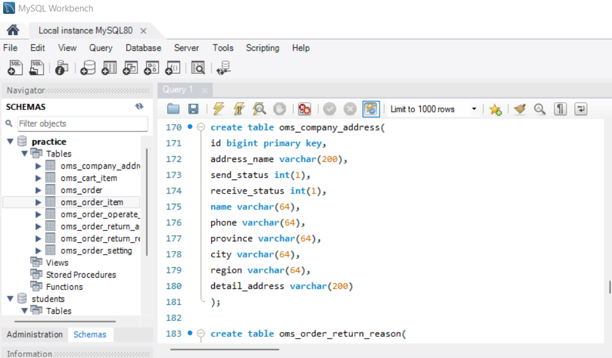
###### 2. Insert some random data to oms_company_address table
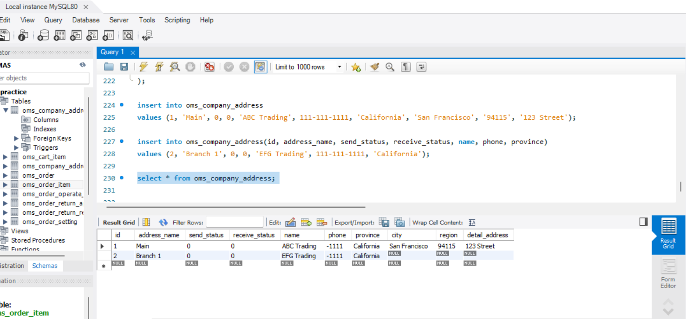
###### 3. Write a SQL query to fetch all data from oms_company_address `table

###### 4. Write a SQL query to fetch top 3 records from oms_company_address table
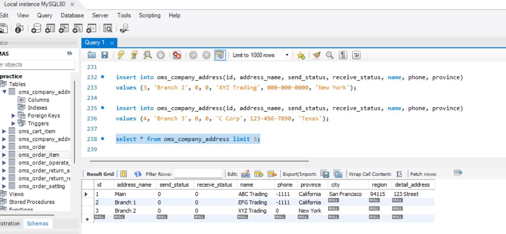
###### 5. Update oms_company_address table to set all phone to 666-6666-8888
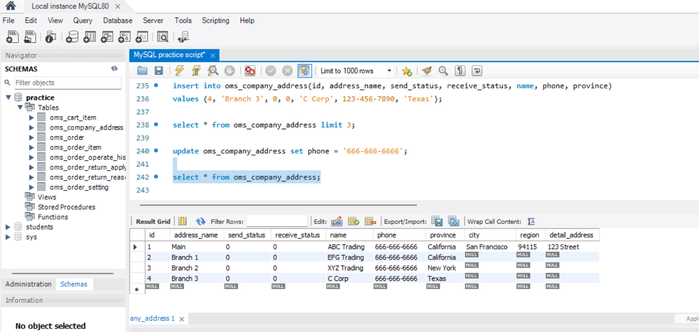
###### 6. Delete one entry from oms_company_address table
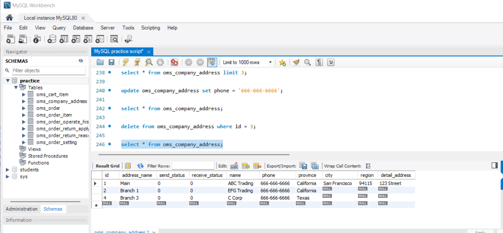
###### 7. (Optional) You can also try to create other tables that listed above
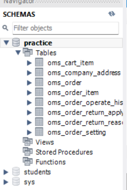
#### NoSQL DB
###### 1. Create test DB
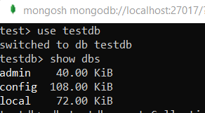
###### 2. Create oms_company_address collection (method: createCollection() )
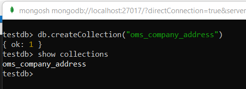
###### 3. Insert few random entries to oms_company_address collection (method: insert() )
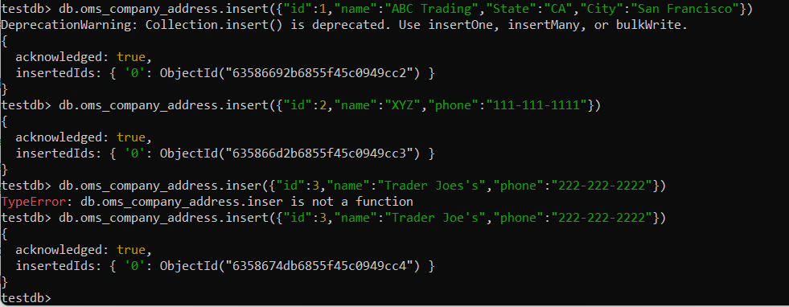
###### 4. Read one entry from oms_company_address collection (method: find() )
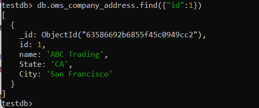
###### 5. Read all entries from oms_company_address collection (method: find() )
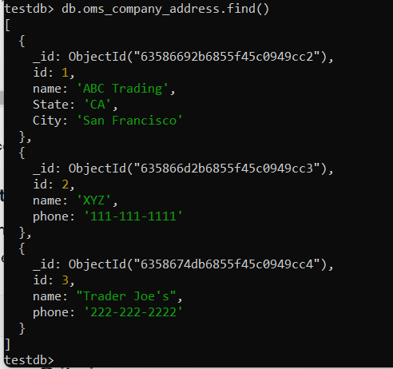
###### 6. Update one entry from oms_company_address collection (method: update() or save() )
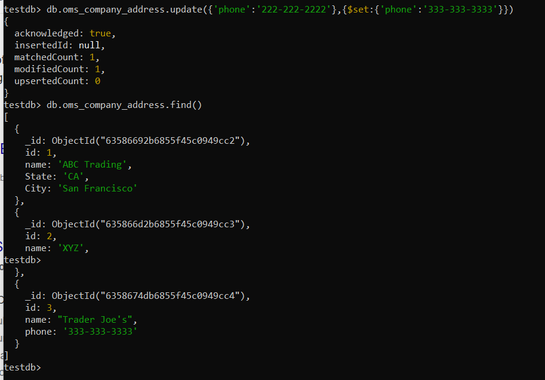
###### 7. Remove one entry from oms_company_address collection (method: remove() )
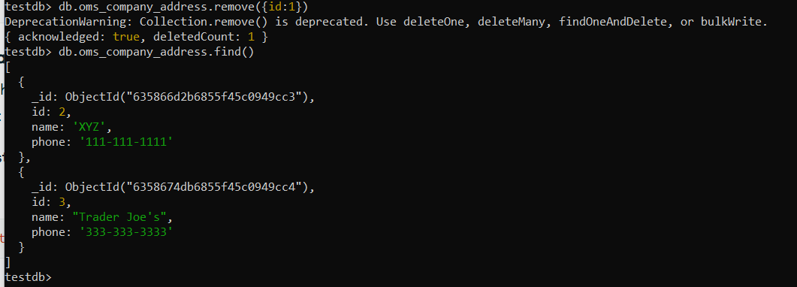
###### 8. (Optional) You can also try to create other tables that listed above
