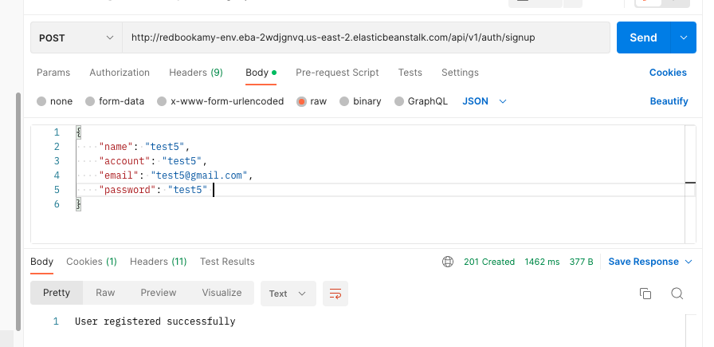
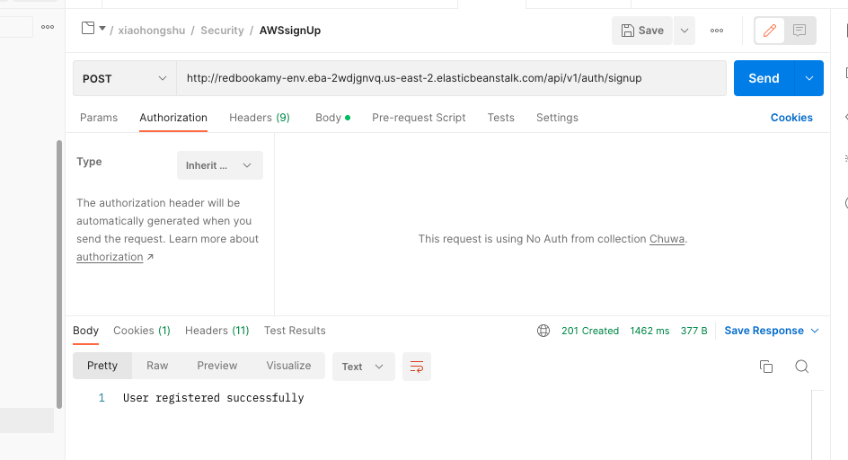
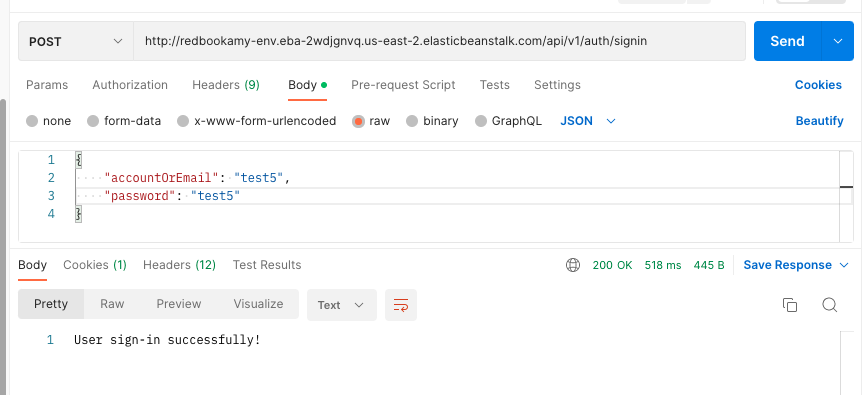
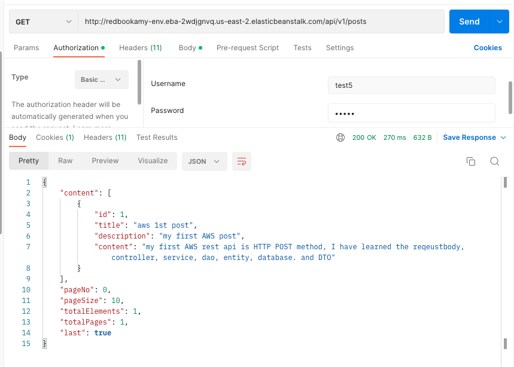
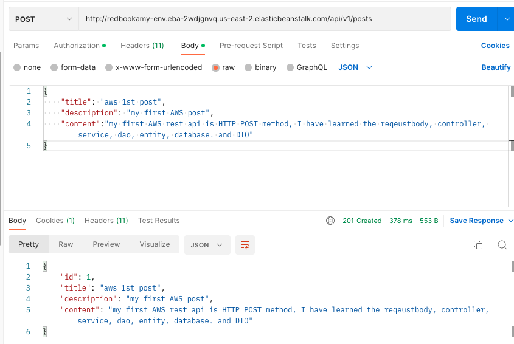

# AWS:
## Sign up:
http://redbookamy-env.eba-2wdjgnvq.us-east-2.elasticbeanstalk.com/api/v1/auth/signup

## Sign in:
http://redbookamy-env.eba-2wdjgnvq.us-east-2.elasticbeanstalk.com/api/v1/auth/signin

## Get API: 
http://redbookamy-env.eba-2wdjgnvq.us-east-2.elasticbeanstalk.com/api/v1/posts

## post API:
http://redbookamy-env.eba-2wdjgnvq.us-east-2.elasticbeanstalk.com/api/v1/posts
